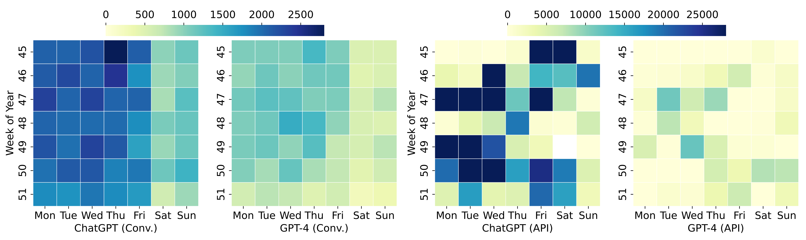
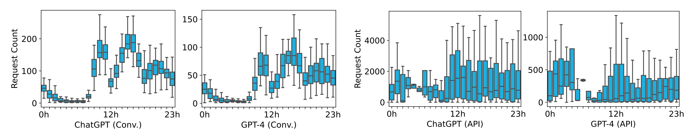
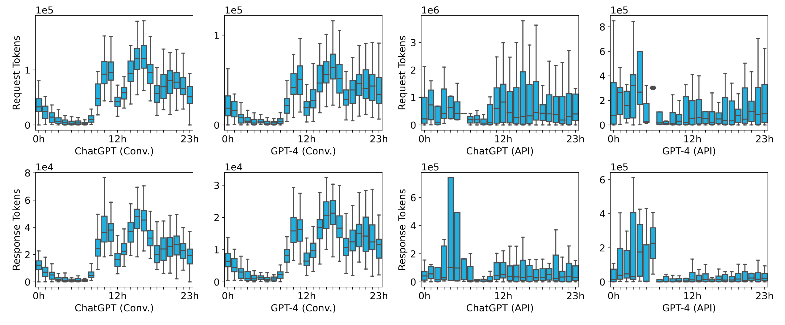
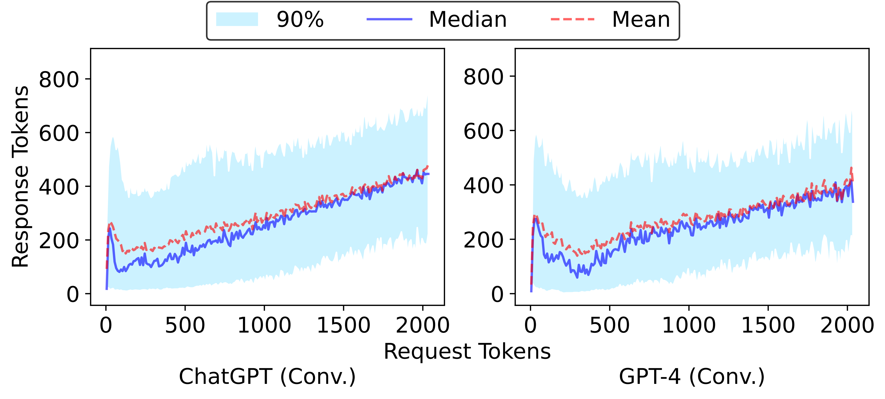

# A GPT-3.5 & GPT-4 Workload Trace to Optimize LLM Serving Systems

> [!IMPORTANT]
> 🚧 Traces with new columns `SessionID` and `Elapsed time` are under collection now and will be available soon!

This repository contains public releases of a real-world trace dataset of LLM serving workloads for the benefit of the research and academic community.

This LLM serving is powered by Microsoft Azure.

There are currently 4 files in `/data`:

- `BurstGPT_1.csv` contains all of our trace in the first 2 months with some failure that `Response tokens` are 0s. Totally 1429.7k lines.

- `BurstGPT_without_fails_1.csv` contains all of our trace in the first 2 months without failure. Totally 1404.3k lines.

- `BurstGPT_2.csv` contains all of our trace in the second 2 months with some failure that `Response tokens` are 0s. Totally 3858.4k lines.

- `BurstGPT_without_fails_2.csv` contains all of our trace in the second 2 months without failure. Totally 3784.2k lines.

## Usage

1. You may scale the average Requests Per Second (RPS) in the trace according to your evaluation setups.
2. You may also model the patterns in the trace as indicated in our [paper](https://arxiv.org/pdf/2401.17644.pdf) and scale the parameters in the models.
3. If you have some specific needs, we are eager to assist you in exploring and leveraging the trace to its fullest potential. Please let us know of any issues or questions by sending email to [mailing list](mailto:ychen906@connect.hkust-gz.edu.cn).

## Future Plans

1. We will continue to update the time range of the trace and add the end time of each request.
2. We will update the conversation log, including the session IDs, time stamps, etc, in each conversation, for researchers to optimize conversation services.
3. We will open-source the full benchmark suite for LLM inference soon.

## Paper

<a href="https://arxiv.org/pdf/2401.17644.pdf" target="_blank"></a>

If the trace is utilized in your research, please ensure to reference our paper:

```bibtex
@misc{wang2024burstgpt,
      title={BurstGPT: A Real-world Workload Dataset to Optimize LLM Serving Systems}, 
      author={Yuxin Wang and Yuhan Chen and Zeyu Li and Xueze Kang and Zhenheng Tang and Xin He and Rui Guo and Xin Wang and Qiang Wang and Amelie Chi Zhou and Xiaowen Chu},
      year={2024},
      eprint={2401.17644},
      archivePrefix={arXiv},
      primaryClass={id='cs.DC' full_name='Distributed, Parallel, and Cluster Computing' is_active=True alt_name=None in_archive='cs' is_general=False description='Covers fault-tolerance, distributed algorithms, stabilility, parallel computation, and cluster computing. Roughly includes material in ACM Subject Classes C.1.2, C.1.4, C.2.4, D.1.3, D.4.5, D.4.7, E.1.'}
}
```

## Main characteristics

- Duration: 121 consecutive days in 4 consecutive months.
- Dataset size: ~5.29m lines, ~188MB.

## Schema

- `Timestamp`: request submission time, seconds from 0:00:00 on the first day.
- `Model`: called models, including `ChatGPT` and `GPT-4`.
- `Request tokens`: Request tokens length.
- `Response tokens`: Response tokens length.
- `Total tokens`: Request tokens length plus response tokens length.
- `Log Type`: the way users call the model, in conversation mode or using API, including `Conversation log` and `API log`.

## Data Overview (First 2 Months)

<!-- <div align="center">
  <br>

  *Figure 1, 2, 3, 4: Periodicity in BurstGPT.*<br>
</div> -->
<div align="center">
  <br>

  *Figure 1: Weekly Periodicity in BurstGPT.*<br>
</div>

<div align="center">
  <br>

  *Figure 2: Daily Periodicity in BurstGPT.*<br>
</div>

<div align="center">
  <br>

  *Figure 3: Average Daily Request and Response Throughput in BurstGPT.*<br>
</div>

<!-- <div align="center">
  <br>

  *Figure 9: Distribution of Request and Response Tokens in BurstGPT and Llama-2-13b-chat.*<br>
</div> -->

<div align="center">
  <br>

  *Figure 4: Statistics of Request and Response Tokens in BurstGPT.*<br>
</div>
