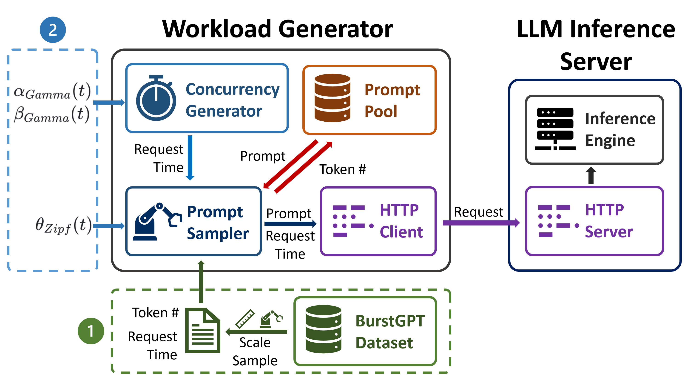

# Demo Use of BurstGPT

This demo use of BurstGPT provides a simple request generator for vLLM serving framework.

<div align="center">
  <br>

  *Figure 1: Workload generator overview. It generates simulations of BurstGPT in a burst manner with two scaling method: 1. RPS Scaling scales the original BurstGPT data; 2. Modeled Scaling uses Gamma distribution parameters to generate request times and Zipf distribution parameter to generate prompt token lengths.*<br>
</div>

## Prepare Environment

Install requirments in a new venv, just run

```sh
pip install -r requirements.txt 
```

or prepare a existing env with the packages listed in `requirements.txt`.

Clone this repo

```sh
git clone https://github.com/HPMLL/BurstGPT.git
```

```sh
cd example
```

## Prepare Server

To run this demo, you need a vLLM API server running either locally or remotely. If you aim to profile the serving system, it might be necessary to modify the vLLM code in order to log system status information.

If you're considering a different serving framework, it is also compatible for all OpenAI compatible server. When error occurs, try to modify the code in `framework_inference_call/framework_vllm.py`.

## Prepare Datasets

`BurstGPT_1.csv` is in `../data` for you to use. You can download other traces in [Release](https://github.com/HPMLL/BurstGPT/releases).

In addition to BurstGPT traces, we also need a prompt dataset.

In our experiments, we use `shareGPT_prompt.json` which contains prompt data from share_GPT like [ShareGPT_Vicuna_unfiltered](https://huggingface.co/datasets/anon8231489123/ShareGPT_Vicuna_unfiltered/tree/main/HTML_cleaned_raw_dataset).

You can choose your prompt pool and process it into format like [example/preprocess_data/shareGPT.json](https://github.com/HPMLL/BurstGPT/blob/main/example/ForwardEnd2end/preprocess_data/shareGPT.json), [example/preprocess_data/pre_shareGPT.py](https://github.com/HPMLL/BurstGPT/blob/main/example/ForwardEnd2end/preprocess_data/pre_shareGPT.py) provides a example to preprocess data.

You can also use [preprocess_data/shareGPT.json](https://github.com/HPMLL/BurstGPT/blob/main/example/ForwardEnd2end/preprocess_data/shareGPT.json) for simply running an example.

## Configure Parameters

Modify parameters in `profile_vllm_trace.sh` as needed.

File Path
- data_path: Specifies the path of the prompt JSON file. Default: "/preprocess_data/shareGPT.json"
- model_path: The path of the tokenizer.
- log_path: The path to save the log file. Default: "./server_log.json"
- detail_log_path: The path to save the detailed log file. Default: "./detail_server_log_1.json"
- burstgpt_path: BurstGPT trace path. Default: "../data/BurstGPT_1.csv"

BurstGPT
- use_burstgpt: Use BurstGPT trace instead of using gamma and zipf distribution. Default: False
- conv_or_api: Using BurstGPT Conv or API trace. Use conv by default. Default: 'conv'
- scale: Scale trace or gamma_scale. When scaling trace 100 means 100 times faster. Default: 1
- prompt_num: Prompt number, 500 by default. Default: 500
- surplus_prompts_num: The total query number (surplus) to send. Default: 16384

Performance Tuning
- max_tokens: The maximum tokens generated. Default: 128
- stream: If set, the output is streaming. This is only applicable for server mode. Default: False

Server Configuration
- host: The server host. Default: 'localhost'
- port: The server port. Default: 17717
- temperature: Refers to the OpenAI API temperature. Default: 0
- seed: The random seed of the prompt set used in shuffle. Default: 0

## Run

Start vLLM engine.

Run `profile_vllm_trace.sh`.

## Contributing

Contributions to improve this tool or extend its capabilities are welcome. Please submit a pull request or open an issue to discuss potential changes or additions.

## License

Under MIT license.