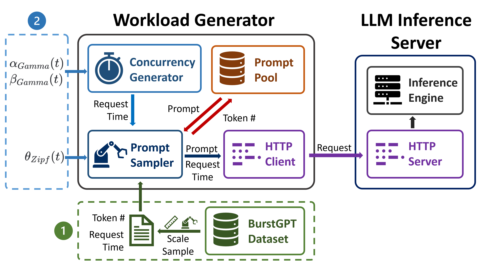

# Demo Use of BurstGPT

This demo provides a simple request generator / profiler for the vLLM
serving framework (and any OpenAI-compatible server).

<div align="center">
  <br>

  *Figure 1: Workload generator overview. It generates simulations of BurstGPT in a burst manner with two scaling methods: 1. RPS Scaling scales the original BurstGPT data; 2. Modeled Scaling uses Gamma distribution parameters to generate request times and a Zipf distribution parameter to generate prompt token lengths.*<br>
</div>

## Layout

```
example/
├── pyproject.toml             # installable package definition
├── src/burstgpt/
│   ├── config.py              # RunConfig dataclass (typed, validated)
│   ├── workload.py            # TraceWorkload / SyntheticWorkload generators
│   ├── prompts.py             # prompt pool + nearest-neighbour matcher
│   ├── backends.py            # vLLM / LightLLM HTTP backends
│   ├── logging.py             # JSON Lines logger
│   ├── runner.py              # asyncio scheduling loop
│   └── cli.py                 # argparse -> RunConfig entry point
├── scripts/preprocess_sharegpt.py
├── preprocess_data/shareGPT.json
├── tests/
├── profile_vllm_trace.sh      # example run
└── start_vllm.sh              # example server launch
```

## Prepare Environment

Install the package (in a fresh venv) — this replaces the old
`requirements.txt` flow and removes the `sys.path` hacks:

```sh
cd example
python -m venv .venv && source .venv/bin/activate
pip install -e .
```

For the ShareGPT preprocessing script and its plotting, install the extra:

```sh
pip install -e '.[preprocess]'
```

## Prepare Server

You need a vLLM API server running locally or remotely. If you profile the
serving system you may need to patch vLLM to log internal status. Any
OpenAI-compatible server works; adjust `src/burstgpt/backends.py` if the
request/response shape differs.

See `start_vllm.sh` for an example launch.

## Prepare Datasets

`BurstGPT_1.csv` ships in `../data`. Download other traces from the
[Releases page](https://github.com/HPMLL/BurstGPT/releases).

You also need a prompt pool. A ready-to-use `preprocess_data/shareGPT.json`
is included. To build your own from a ShareGPT-style dump (e.g.
[ShareGPT_Vicuna_unfiltered](https://huggingface.co/datasets/anon8231489123/ShareGPT_Vicuna_unfiltered)):

```sh
python scripts/preprocess_sharegpt.py \
    --data_path sg_90k_part1_html_cleaned.json \
    --model_path /path/to/tokenizer \
    --out_path preprocess_data/shareGPT.json
```

It writes `{idx: {prompt, len_prompt, output, len_output}}`, the format the
benchmark's prompt matcher expects.

## Configure & Run

All knobs are CLI flags mirroring `RunConfig` fields. Common ones:

| Flag | Meaning | Default |
| --- | --- | --- |
| `--use_burstgpt` | Replay a trace instead of synthetic gamma/zipf | off |
| `--burstgpt_path` | Trace CSV path | `../data/BurstGPT_1.csv` |
| `--conv_or_api` | `conv` or `api` log type | `conv` |
| `--scale` | Trace RPS scaling (100 = 100x faster) | `1` |
| `--prompt_num` | Trace rows to load | `500` |
| `--surplus_prompts_num` | Total queries to issue | `16384` |
| `--backend` | `vllm` or `lightllm` | `vllm` |
| `--host` / `--port` | Server address | `localhost:17717` |
| `--stream` | Stream responses | off |
| `--max_tokens` | Max tokens generated | `128` |
| `--log_path` / `--detail_log_path` | JSONL output files | — |

Start the vLLM engine, then run the example:

```sh
./profile_vllm_trace.sh
```

Run `burstgpt-bench --help` for the full flag list. Logs are written as
JSON Lines (one record per line).

## Tests

```sh
pip install -e '.[dev]'
pytest
```

## Contributing

Contributions to improve this tool or extend its capabilities are welcome.
Please submit a pull request or open an issue.

## License

Under MIT license.
